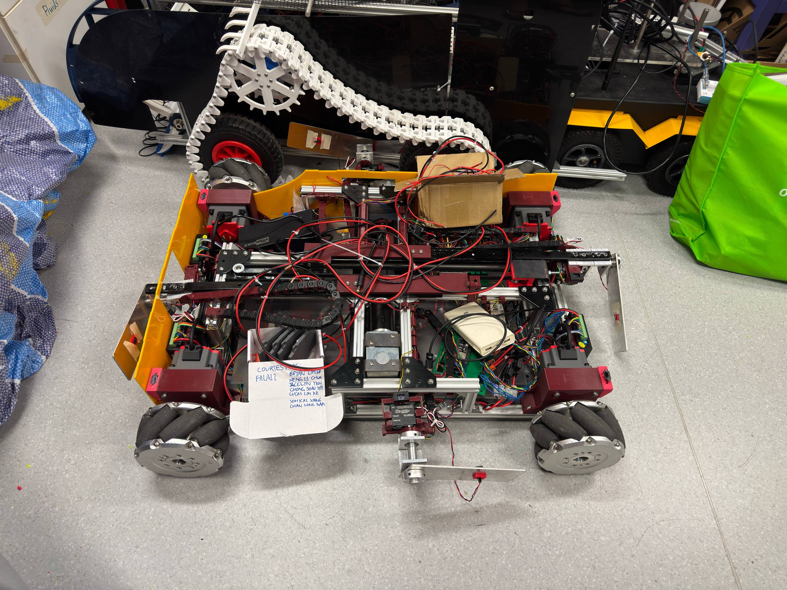
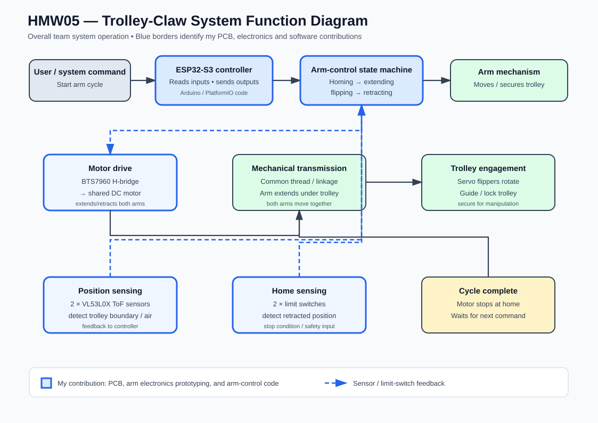
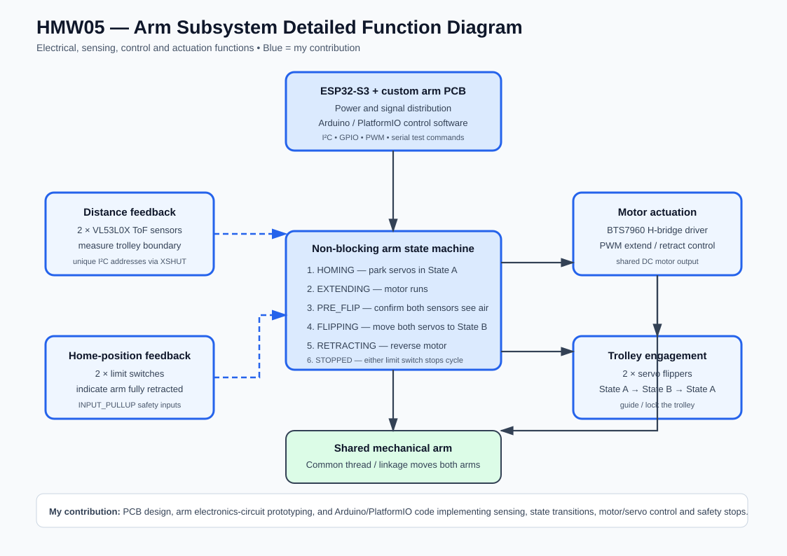
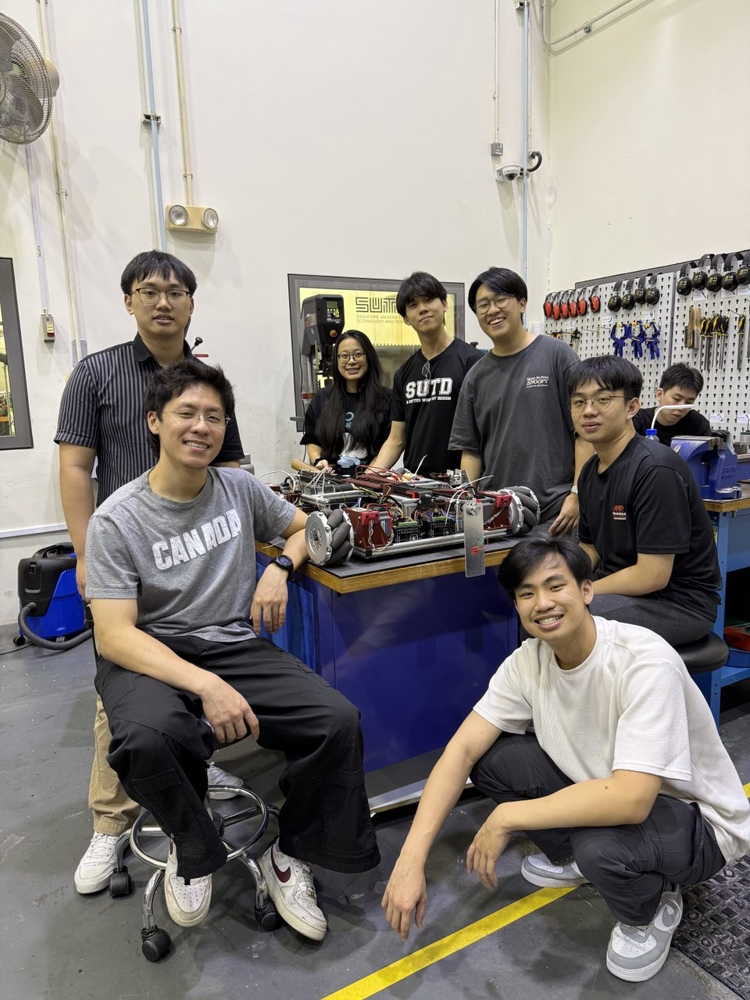
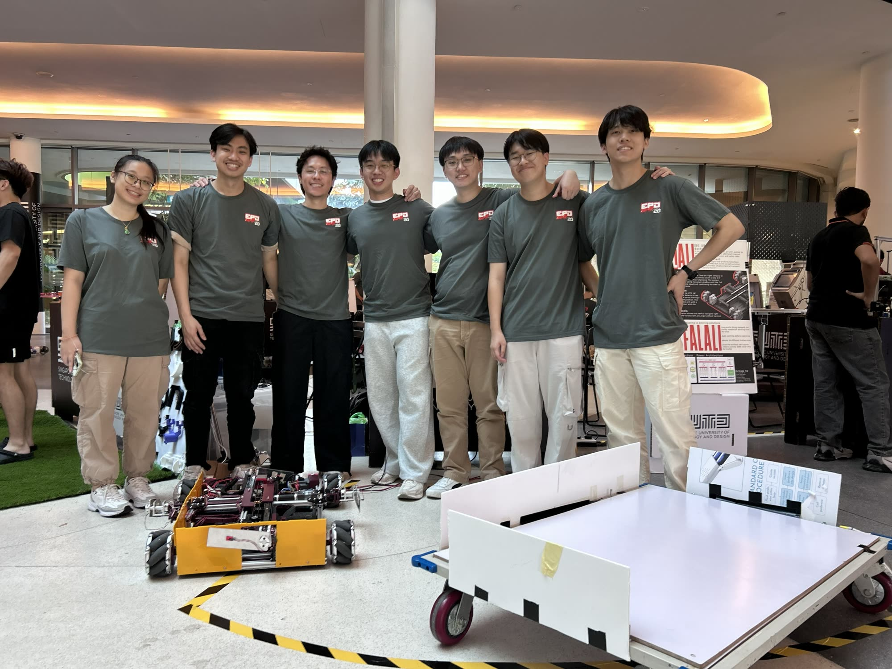
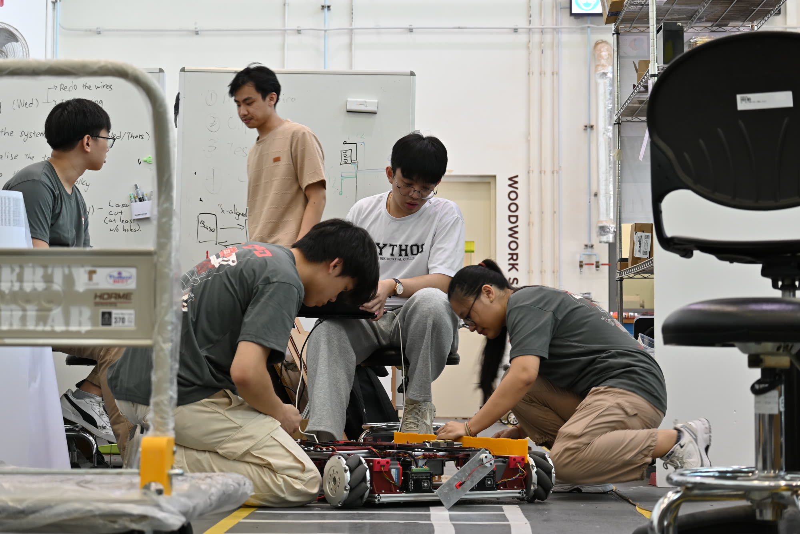
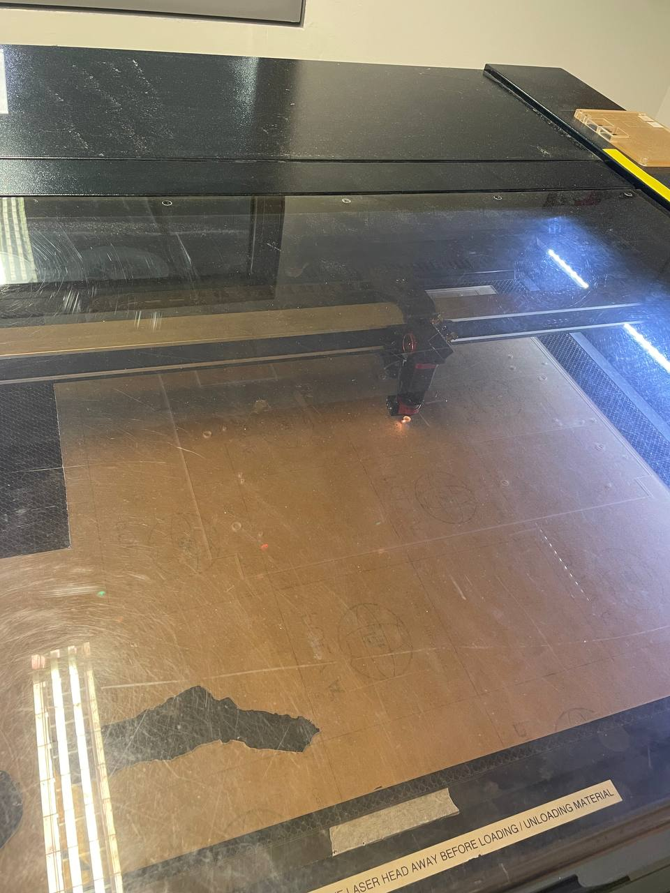

# Falali — a 30.007 project

An AMR-style **under-ride platform** that drives beneath a textile trolley, uses upward-facing
time-of-flight sensors to confirm it is under the trolley and centred, **clamps** onto the
underside, and then moves the trolley. ESP32-S3 firmware, hardware and documentation.

This is also the whole-project home for **Falali — One AMR Fits All** (SUTD 30.007 Engineering
Design Innovation, Group 10): a low-profile autonomous mobile robot that moves existing fabric
trolleys in a textile factory by driving *underneath* them, clamping on, and transporting them —
no changes to the trolleys or the factory floor.

- **Controller:** ESP32-S3-WROOM-1 **N16R8** (16 MB flash, 8 MB octal PSRAM)
- **No** LiDAR, camera, ROS 2, SLAM, or mapping.

> **Architecture change in progress (2026-08-04).** With 4× AS5600 wheel encoders and a BNO085 IMU
> added, control moves to a **Raspberry Pi 5** driving two ESP32s over USB serial (base + arm). The
> ESP32 is no longer the entire control stack. See
> [`docs/superpowers/specs/2026-08-04-rpi5-main-controller-design.md`](docs/superpowers/specs/2026-08-04-rpi5-main-controller-design.md)
> and the [Pi setup runbook](docs/rpi5-setup.md). Everything below still describes the current,
> working single-ESP firmware — migrate in the order the spec gives.
>
> **Status note (2026-08-23):** the delivered term prototype did **not** use the Raspberry Pi 5.
> It runs on the two ESP32s alone — base ↔ arm over Wi-Fi (ESP-NOW); the Pi path above stays the
> planned next step, and the [`pi/`](pi/) tooling is kept for it.
>
> **Hardware documentation lives in [`docs/hardware/`](docs/hardware/)** — power-up runbook,
> component list, per-connector pinouts for all three PCBs (extracted from the KiCad netlists, not
> inferred), and a fabrication/repair guide. [`docs/hardware-architecture.md`](docs/hardware-architecture.md)
> is the older companion and is partly superseded by it. The pin table further down this README is
> the *pre-PCB design intent* and does **not** match the fabricated board.

Full design: [`docs/superpowers/specs/2026-07-06-falali-esp32-docking-design.md`](docs/superpowers/specs/2026-07-06-falali-esp32-docking-design.md).

## Results against requirements

| Requirement | Target | Result |
|---|---|---|
| Fit under trolley clearance | ≤ 200 mm | **167 mm**, validated on the physical chassis |
| Move loaded trolley | ≥ 100 kg | **Passed — load moved with two people standing on top** |
| Clamp holding force | ≥ 300 N | Weakest-link analysis: clamp capacity 403 N (SF 1.34×) |
| Clamp vertical reach | ≥ 200 mm | Met |
| Docking time | ≤ 1 min | Under 60 s in testing |
| Worst-case castor misalignment | All 4 orientations | Moves under all |

Derivations, test protocols and data: [`docs/pdr-falali-amr.pdf`](docs/pdr-falali-amr.pdf)
(Preliminary Design Review deck, 11 Aug 2026).

## Delivered system

```
ESP-BASE (Wheel Drive PCB)                  ESP-ARM (Arm Subsystem PCB)
docking state machine                       arm axes X/Y, flipper servos, clamp
mecanum mixing, 4× corner ToF centring   ⇄  limit switches, homing
clamp handoff                             ESP-NOW over Wi-Fi (channel 1)

operator: serial teleop ([teleop.py](teleop.py)) or BLE gamepad ([bench_ble/](bench_ble/))
```

Commercial AMRs don't fit this job: platform AMRs are too tall to get under the trolleys, tow
tractors need turning space, side-docking systems need the trolley modified. The answer is
**under-entry capture**: fit under the ≤200 mm clearance, strafe beneath an existing trolley with
mecanum drive, confirm centring sensor-only, clamp and carry.



## Safety principle

**The clamp must not engage unless the alignment logic CONFIRMS the platform is centred.** Limit
switches only confirm clamp *travel*; they never authorise clamping. `SafetyMonitor` is the single
gate (`confirmed && no faults && !E-stop`), and the docking state machine reaches the clamp handoff
only after a sustained `CONFIRM`. The clamp/arm mechanism itself is an **external subsystem** that
plugs in at the `IClamp` port.

## Architecture — hexagonal (ports & adapters)

```
lib/ports      pure C++ interfaces + shared types (no Arduino)
lib/domain     the hand-written core:  CornerEdgeDetector · DeadReckonOdometry · SafetyMonitor · DockingStateMachine
lib/drive      MecanumDrive (mixes body-frame vx/vy/omega -> 4 wheels)
lib/fakes      desktop test doubles for every port
lib/hal_esp32  Arduino adapters over popular libraries
include/       config.h (tunables) · pins.h (GPIO map)
src/main.cpp   composition root: builds adapters, wires domain, runs the loop
test/          host unit tests (Unity)
```

Dependency rule: **domain → ports** only; **adapters → ports**; **main → everything**. The domain
never includes Arduino, so it compiles and tests on a laptop. Commodity work uses popular libraries
(`pololu/VL53L0X`, `Bounce2`, `ArduinoJson`, `SerialCommands`, ESP32 `LEDC`); only the docking
sequence, corner edge detection, odometry, and safety logic are hand-written — and that is the part
under test.

**Alignment method:** with a solid trolley board and 4 corner ToF sensors, docking is a deterministic
geometric sequence — `APPROACH → ORIENT` (rotate until both front corners see the edge) `→ CENTER_X`
(odometry-centre between near/far edges) `→ CENTER_Y` (same, strafing) `→ CONFIRM → clamp handoff`.
Centring uses dead-reckoning odometry; driving to the midpoint between two edge events makes it robust
to calibration error.

**ToF wiring, both ESPs:** all four corner sensors keep their factory address `0x29` and are brought
up one at a time via **XSHUT re-addressing** — `Vl53l0xArray` on the base, `TofSensorArray` in
`arm/`. An earlier design multiplexed them through the PCA9548A breakout in
[`KiCad/PCA9548A Breakout/`](KiCad/PCA9548A%20Breakout/); final firmware uses no mux, and the
breakout is kept as history of that era.

## Build, test, flash

```bash
# Host unit tests of the pure core — no hardware needed:
pio test -e native

# Compile / upload the firmware (fetches lib_deps):
pio run -e esp32s3
pio run -e esp32s3 -t upload
pio device monitor -b 115200
```

Arm subsystem firmware has its own project: [`arm/`](arm/README.md).

## Serial interface (USB-CDC @115200)

Commands in (newline-terminated): `DOCK`, `ABORT`, `UNCLAMP`, `STATUS`.
Status out is JSON, e.g.:

```json
{"state":"CENTER_X","corners":[true,true,false,false],"x_mm":142.0,"y_mm":-3.0,
 "theta":0.02,"confirmed":false,"motor_alarm":false,"overcurrent":false,"estop":false}
```
(`corners` is `[FL, FR, RL, RR]`.)

## Pin map — ESP32-S3-N16R8

> ## 🛑 The table below is WRONG. Do not wire or flash from it.
>
> It is the **pre-PCB design intent** and does not match the fabricated board. On the real board
> GPIO4–7 are the **ToF XSHUT** lines, not wheel SV, and GPIO38/39 are **motor brake** lines, not
> I²C. Using this map would drive the I²C bus as motor enables.
>
> **The real map is [`include/pins.h`](include/pins.h)**, extracted from the KiCad netlist, with
> per-connector pinouts in [`docs/hardware/boards.md`](docs/hardware/boards.md).
>
> Kept here only because it is referenced by older notes. It should be deleted.

Reserved on the N16R8: **GPIO26–37** (flash + octal PSRAM) and **GPIO19/20** (USB-CDC).

| Group | Signals | GPIO |
|---|---|---|
| Wheel speed (SV, PWM) | FL/FR/RL/RR | 4, 5, 6, 7 |
| Wheel direction (F/R) | FL/FR/RL/RR | 15, 16, 17, 18 |
| Wheel enable / brake (ganged) | EN / BRK | 8 / 9 |
| Wheel fault (wire-OR) | ALARM | 10 |
| Clamp (BTS7960) | RPWM / LPWM / EN | 11 / 12 / 13 |
| Clamp current sense (ADC1) | IS close / open | 1 / 2 |
| Limit switches | open / closed | 14 / 21 |
| E-stop | button | 47 |
| ToF I²C | SDA / SCL | 38 / 39 |

## Hardware bring-up checklist (before trusting it under a trolley)

The `hal_esp32` adapters compile against the libraries but are **not yet hardware-validated**. On the
bench, verify and adjust:

1. **PWM API** — a `PwmPin` shim supports Arduino-ESP32 core 2.x *and* 3.x automatically.
2. **BLD120A polarities** — `F/R` forward sense, and active-low `EN`/`BRK`/`ALARM` (`Bld120aMotor.h`).
3. **Mecanum + orient signs** — confirm forward / strafe / yaw directions (`MecanumDrive.cpp`) and the
   `ORIENT` rotate-direction sign in `DockingStateMachine.cpp` (rotate toward the lagging corner).
4. **ToF corners** — FL/FR/RL/RR on their XSHUT pins (`pins::kTofXSHUT`; `Vl53l0xArray` is the
   default backend since the mux approach was retired); set the board
   **height band** (`makeCornerConfig`).
5. **Odometry calibration** — measure `max_lin_mm_s` / `max_ang_rad_s` (`makeOdometryCal`); tune the
   centring tolerance/offsets in `makeDockConfig`.
6. **BTS7960 current scale** — calibrate `amps_per_volt` and `cfg::kClampStallAmps`.
7. **Dry-run the alignment** and watch the JSON telemetry (`corners`, `x_mm`, `y_mm`, `confirmed`). The
   clamp/arm subsystem is external and validated separately at the `IClamp` handoff.

## Custom PCBs

Connector-level references for all boards (every pin extracted from the KiCad netlists):
[`docs/hardware/boards.md`](docs/hardware/boards.md).

| Board | Size | KiCad project | Job |
|---|---|---|---|
| **Wheel Drive PCB** | 130 × 105 mm | [`KiCad/Wheel Drive PCB/`](KiCad/Wheel%20Drive%20PCB/) | base ESP + 4 motor-driver adapters + all base sensors |
| **Driver PCB** ×4 | 42.8 × 33.8 mm | [`KiCad/Driver PCB/`](KiCad/Driver%20PCB/) | 3.3 V → open-collector adapter, one per motor |
| **Arm Subsystem PCB** | 110 × 110 mm | [`KiCad/Arm Subsystem PCB/`](KiCad/Arm%20Subsystem%20PCB/) | arm ESP + 2 H-bridges + servos + 8 limit switches |
| PCA9548A breakout | — | [`KiCad/PCA9548A Breakout/`](KiCad/PCA9548A%20Breakout/) | I²C mux — **historical**, see ToF note above |

JLCPCB fab outputs ship with each project (`fab-output/` folders; the Arm board's zip is in its
folder). Board designs by Kai Xiang & Heng Li (arm/wheel sensor side) and Bryan Lim (base).

## Demos

| | |
|---|---|
| <video src="docs/media/videos/load-test-100kg.mp4" controls width="320"> | **Load test** — ≥100 kg requirement load, two people on top |
| <video src="docs/media/videos/wheel-subsystem-driving.mp4" controls width="320"> | Mecanum base driving and strafing |
| <video src="docs/media/videos/arm-subsystem-demo.mp4" controls width="320"> | Arm extension / flipper / release sequence |
| <video src="docs/media/videos/clamped-on-trolley.mp4" controls width="320"> | Clamped onto a trolley |

*(GitHub renders `<video>` tags in markdown; if your viewer doesn't, open the files under
[`docs/media/videos/`](docs/media/videos/).)*

<details>
<summary>All clips kept in the repo</summary>

| File | What it shows |
|---|---|
| [`trolley-carry-demo.mp4`](docs/media/videos/trolley-carry-demo.mp4) | full trolley-carry run (1:49) |
| [`clamping-on-sequence.mp4`](docs/media/videos/clamping-on-sequence.mp4) | clamp engaging under the trolley (0:56) |
| [`rail-strength-test.mp4`](docs/media/videos/rail-strength-test.mp4) | rail strength durability test (0:29) |
| [`img-3340.mp4`](docs/media/videos/img-3340.mp4) | bench footage (0:51) |
| [`img-3350.mp4`](docs/media/videos/img-3350.mp4) | bench footage (0:43) |
| [`video-2026-07-13.mp4`](docs/media/videos/video-2026-07-13.mp4) | mid-build progress clip (0:16) |
| [`video-2026-07-17.mp4`](docs/media/videos/video-2026-07-17.mp4) | mid-build progress clip (0:10) |
| [`clip-20260707.mp4`](docs/media/videos/clip-20260707.mp4) | early drive test (0:05) |

</details>

### Function diagrams

| System flow | Arm subsystem |
|---|---|
| [](docs/function-diagram-01-system-flow.png) | [](docs/function-diagram-02-arm-subsystem.png) |

*(SVGs render inline above; click through for the higher-resolution PNGs.)*

<details>
<summary>More photos</summary>

| | | |
|---|---|---|
|  |  |  |
|  | | |

All photos: [`docs/media/photos/`](docs/media/photos/).
</details>

## Team — Group 10

| Member | Focus areas |
|---|---|
| Chan Long Nam | mechanical structure & clamping system |
| Chong Shao Yih | chassis & integration |
| [Chua Heng Li](https://github.com/chuahengli) | electronics: arm-subsystem & wheel-drive PCBs, power wiring, arm firmware |
| Jacelyn Tan | systems analysis & testing |
| Lim Nguyen Ping, Bryan | drive firmware, sensing & base architecture (this repo) |
| Lucas Lim Kong Keong | clamping mechanism & materials |
| Soh Kai Siang | power distribution & wiring; co-author of arm firmware |

*Rows are initial attributions — each member, feel free to refine your own.*

## Repository map

| Path | What it is |
|---|---|
| [`src/`](src/README.md) | firmware entry + bench bring-up sketches |
| [`lib/`](lib/README.md) | hexagonal core: ports, domain, drive, fakes, ESP32 adapters |
| [`include/`](include/config.h) | tunables (`config.h`) and GPIO map (`pins.h`) |
| [`test/`](test/README.md) | host unit tests (Unity, `pio test -e native`) |
| [`arm/`](arm/README.md) | vendored arm-subsystem firmware (ESP-NOW slave) |
| [`KiCad/`](KiCad/README.md) | four custom board projects + fab outputs |
| [`pi/`](pi/README.md) | Raspberry Pi 5 bridge tooling (planned next step, not used by the delivered prototype) |
| [`bench_ble/`](bench_ble/README.md) | BLE-gamepad bench firmware |
| [`tools/`](tools/README.md) | PCB production test, AS5600 tuner, Pi bootstrap |
| [`docs/`](docs/) | specs, gotchas, hardware references, runbooks, session history, media |

## Acknowledgements

- Course 30.007 Engineering Design Innovation, SUTD; reviewed by Prof. Bradley Camburn and Prof. Wai Lee Chan
- Firmware drafting and design-analysis support used AI tooling (Claude, Gemini), as disclosed in the PDR
