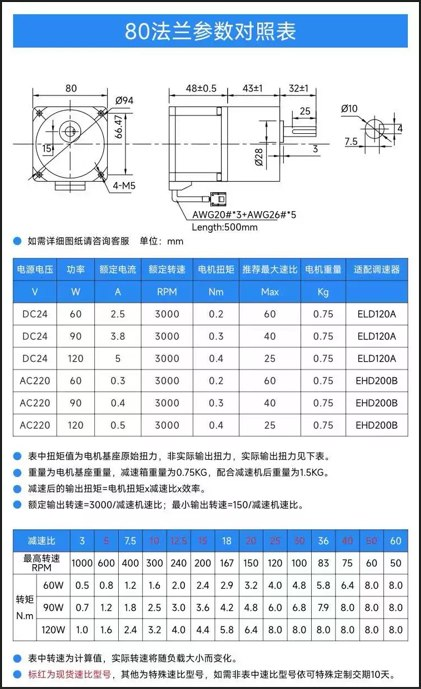

# Component list

What is on the robot, what each part is doing there, and what it is worth
keeping if the robot is broken up for parts.

Rows marked **⬚ TO FILL** are things that exist physically but whose
specifications were never written down. They are listed rather than omitted so
nobody mistakes a gap for a completed survey.

---

## 1. Power

| Qty | Part | Spec | Notes |
|---|---|---|---|
| 1 | Battery pack | **36 V, 10 Ah**, internal BMS | **Custom-built — no datasheet exists.** The BMS is what latches off on buck inrush (`startup.md` §3), and its trip threshold is therefore unknown |
| 1 | Main switch | **40 A** | Feeds all three bucks |
| 1 | Buck converter | 36/48 V in → **24 V, 30 A** (720 W) | wheel motors |
| 1 | Buck converter | 24/36/48 V in → **12 V, 25 A** (300 W) | arm extension, behind the button |
| 1 | Buck converter | 36/48/60 V in → **5 V, 20 A** (100 W) | servos + BTS7960 logic |
| 1 | Latching mushroom button | **1NO 1NC DPST**, AC 660 V 10 A, latching self-lock | Gates the **red (positive) conductor of the 12 V buck's input**. **Wired as an ENABLE, not an E-stop** — read `startup.md` §1 |
| 1 | Fuse | 10 A *(claimed in `hardware-architecture.md` §6)* | ⬚ TO FILL: rating confirmation and physical location |
| — | Pack charger | ⬚ TO FILL | Must match a pack whose cell count and BMS are undocumented |
| — | ESP power | USB **power bank** | Both ESP32-S3 boards. Independent of the pack entirely |

> **The mushroom button is rated for AC, and is switching DC.** AC 660 V 10 A is
> an alternating-current rating, where the current crosses zero 100 times a second
> and any arc self-extinguishes. A 36 V DC arc does not, so the DC breaking
> capacity of these contacts is materially lower than the printed figure. It is
> switching the 12 V buck's input — under 10 A even at the buck's full 300 W
> output, and far less at normal arm loads — so this is a note about margin, not
> a fault. **[The AC rating is printed on the part; no DC rating is quoted.]**

> **The battery is the least documented part of the robot.** It was custom-built,
> so there is no cell chemistry, no BMS part number, no continuous or peak
> discharge rating, and no charge profile written down anywhere. Everything the
> robot does electrically is bounded by a component whose limits cannot be looked
> up. Opening the pack and recording the cells and BMS is the only way to
> establish them.

**Rail loads:**

| Rail | Feeds |
|---|---|
| 24 V | 4× BLD-120A wheel driver |
| 12 V | arm-extension wormgear motors, via the BTS7960 B+/B− terminals |
| 5 V | Arm PCB J3 → 4× flipper servo + both BTS7960 logic supplies |
| USB | both ESP32-S3 boards — **not fed from the pack** |

---

## 2. Drivetrain

| Qty | Part | Spec | Notes |
|---|---|---|---|
| 4 | **BLD-120A** BLDC driver | 12–30 V in; **8 A continuous, 30 A instantaneous (<3 s)** | Native PWM speed input. No ALM output — "RUN/ALM" is an LED only |
| 4 | BLDC gearmotor | **80 mm flange, DC 24 V, 3000 RPM, 15:1** | Full table below |
| 4 | Mecanum wheel | **150 mm** diameter | |
| 4 | Custom motor mount | machined, already fitted | Diametric magnets already bonded to the shafts (for the abandoned encoders) |

### Motor — 80 mm flange series

Datasheet: [`img/motor-80-flange-spec-table.jpeg`](img/motor-80-flange-spec-table.jpeg):



| | |
|---|---|
| Flange | 80 × 80 mm, 4× M5 |
| Supply | **DC 24 V** — matches the 24 V rail |
| Rated speed | **3000 RPM** at the motor |
| Gearbox | **15:1** (a stocked ratio) — see the caveat below |
| Output shaft | Ø10 mm, ~25 mm usable |
| Weight | 0.75 kg motor, **1.5 kg with gearbox** → ~6 kg of gearmotor on the robot |
| Cable | **AWG20 × 3 + AWG26 × 5**, 500 mm |

> ⚠️ **Confirm the gearbox ratio off its own label if anything depends on it.**
> The purchase listing groups this motor as *"80 flange, 120 W, 24 V, ratio
> 10–18"*, so the ratio is a purchase option within a band rather than a fixed
> property of the part number. Everything in this project has been documented as
> **15:1**, and the speed ceiling below is computed from it — but the ceiling
> moves a long way across that band: 10:1 gives 2356 mm/s, 15:1 gives 1571 mm/s,
> 18:1 gives 1309 mm/s. At 18:1 the ceiling would fall *below* one of the existing
> `max_lin_mm_s` estimates. **[The 15:1 figure is inherited from earlier project
> notes, not read off the gearbox.]**

### The variant fitted is **120 W** **[VERIFIED — Bryan, 2026-08-16]**

| | 60 W | 90 W | **120 W ← fitted** |
|---|---|---|---|
| Rated current | 2.5 A | 3.8 A | **5 A** |
| Base torque | 0.2 N·m | 0.3 N·m | **0.4 N·m** |
| Output torque at 15:1 | 2.4 N·m | 3.6 N·m | **4.8 N·m** |
| Datasheet max ratio | 50 | 40 | **25** — 15:1 is within it |

**This sets P-sv: 120 W**, which is the **top of the trim's 30–120 W range**. See
`startup.md` §6.

### What 120 W × 4 means for the rest of the machine

| | |
|---|---|
| Tractive force per wheel (torque-limited) | 4.8 N·m ÷ 0.075 m = **64 N** |
| All four wheels | **256 N** |
| Current at rated load | 5 A × 4 = **20 A at 24 V = 480 W** |
| Same, drawn from the 36 V pack | ~13.3 A ideal, **~15.7 A at 85 % buck efficiency** |
| Driver headroom | 8 A each = 32 A at 24 V, well above the motors' 20 A |
| Pack endurance at full drivetrain load | 360 Wh × 0.85 ÷ 480 W ≈ **38 min**, and less in practice — a pack is not discharged to empty |

Two things worth drawing out of that table:

- **The 24 V buck is rated 30 A** against a ~20 A four-wheel demand — about 50 %
  headroom, so the drivetrain rail is adequately sized. The pack sees ~16 A
  through it.
- **256 N of tractive force is more than the tyres can use.** This is the
  quantitative version of the conclusion the caster research already reached:
  **traction, not torque, is the limit**, which is why the clamp has to transfer
  trolley weight onto the robot's own wheels rather than merely grip. A 200 kg
  trolley is not moved by having enough motor. **[HYPOTHESIS on the exact
  traction figure — it depends on robot mass and floor µ, neither recorded.]**

> The motor datasheet lists **ELD120A** as the matching controller for the DC 24 V
> variants. **The robot does not use one — there is no ELD anywhere on this
> machine, only BLD-120A.** The driver was bought separately and is sold for
> exactly this duty ("12V 24V, within 120 W, 42/57/60 frame, with hall
> controller"). The ELD reference in the motor datasheet is simply a different
> product. **[VERIFIED — Bryan, 2026-08-17]**

### The 5 wires nobody is using

`AWG20 × 3 + AWG26 × 5` is three phase wires and **five hall-sensor wires**
(V+, GND, HA, HB, HC). **The motors have hall sensors. They always did.**

The BLD-120A simply does not bring them out — it has no FG or tacho terminal,
which is why `gotchas.md` §13 says there is no wheel-speed feedback. But the
signal exists inside the motor cable.

As a route back to wheel-speed feedback it is considerably less involved than
the AS5600 encoders, which failed for two independent board-level reasons
(`boards.md` §1). One hall line per motor into a spare GPIO would give 3 pulses
per motor revolution = 45 per wheel revolution at 15:1 — enough resolution for
stall detection and speed estimation. **[HYPOTHESIS — the wire count
and colours are from the datasheet; nobody has put a scope on them.]**
*Experiment: with 24 V applied and a wheel turned by hand, scope any AWG26 line
against motor ground. A 3-per-rev square wave confirms it.*

### Speed ceiling — an independent check on `max_lin_mm_s`

The gearing fixes the top speed, and this is the first hard number the project
has had for it:

```
3000 RPM ÷ 15         = 200 RPM at the wheel
π × 150 mm            = 471.2 mm circumference
200 / 60 × 471.2      = 1571 mm/s          ← hard geometric ceiling
```

`gotchas.md` Open Issue B lists four estimates of `max_lin_mm_s` spanning
1155–1657 mm/s. Against a 1571 mm/s ceiling:

| Estimate | % of ceiling | |
|---|---|---|
| 1155 | 74 % | plausible |
| **1231** *(in `config.h`)* | **78 %** | plausible |
| 1384 | 88 % | plausible, optimistic |
| 1657 | **105 %** | **impossible — rejected** |

**[VERIFIED — datasheet arithmetic]** This does not prove 1231 is right, but it
removes the top of the range and shows the configured value is sensibly below a
real physical limit.

The datasheet also gives a **minimum** output speed of 150 RPM ÷ 15 = 10 RPM =
**79 mm/s**. Measured break-away is ~413 mm/s — **five times higher than the
drivetrain's stated minimum.** That points the "minimum speed" open item in
`hardware-architecture.md` §9 at **friction and load**, not at gearing, wheel
diameter or the driver's control range. **[HYPOTHESIS — arithmetic is solid, the
friction explanation is inferred.]**

### BLD-120A driver detail

**[VERIFIED — `BLDC-BLD120A-bldc-motor-controller-specs.pdf`, read 2026-08-16]**

| | |
|---|---|
| Supply | 12 / **24** / 30 V DC (min / typ / max) |
| Output current | **8 A** rated, 30 A instantaneous (< 3 s) |
| Size | 96 × 60 × 24.5 mm |
| Terminals | `BRK EN F/R COM SV` · `REF+ HU HV HW REF−` · `W V U` · `DC+ DC−` |
| Trims | **RV**, **P-sv**, **ACC/DEC** — three, not two. `startup.md` §6 |
| Indicator | Green = power good, red = fault. **One LED, not an output** |

**Three settings per driver** — see `startup.md` §6. **RV** fully anticlockwise
or external speed control fails; **P-sv** to 5 A / 120 W; **ACC/DEC** to minimum.

#### The PWM frequency question is settled: **1–3 kHz**

The two older manuals disagreed — `BLD-120-English-version.pdf` says 1–10 kHz,
`SYS-BLD-120A-manual.pdf` says 1–3 kHz. **The BLD-120A-specific spec sheet
agrees with the SYS manual:** *"The pulse frequency range: 1-3KHz."*

The firmware's **2 kHz** (`pins::kSvPwmFreqHz`) is correct. The 5 kHz value that
`hardware-architecture.md` §3 used to carry was **outside spec**, and the 20 kHz
before it was well outside.

**Duty range matters too:** the datasheet advises **2 %–90 %**, where 2 % duty =
5 % of top speed and **90 % duty = maximum**. Commanding 100 % is outside the
advised range and buys nothing.

#### There is definitively no speed or alarm output

The English manual's feature list advertises *"Speed signal output"* and
*"Abnormal alarm signal output."* **Both are boilerplate that does not match this
driver.** The Driver Control Terminal table in that same document lists exactly
five pins — `SV COM F/R EN BRK` — and the spec sheet's full port table adds only
hall, motor and power terminals. There is no FG pin and no ALM pin anywhere.
"RUN/ALM" is an LED.

This confirms what was bench-established on 2026-07-27 and is recorded in
`pins.h` (`kWheelALARM == kNoPin`). **The feature bullet is the thing that is
wrong, not the project's conclusion** — worth knowing, because that bullet is
exactly the kind of thing that sends someone hunting for a terminal that does not
exist.

#### The hall signals are on the driver's own screw terminals

`REF+ HU HV HW REF−`. This makes the speed-feedback idea in §2 above much easier
than it first looked: **no cable splicing** — the hall lines land on accessible
screw terminals on each driver.

⚠️ They are **5 V** logic (`REF+` is the hall supply positive). The ESP32-S3 is
not 5 V tolerant, so a divider or level shifter is mandatory.

#### ⚠️ Our 3.3 V SV drive may be costing ~30 % of top speed **[HYPOTHESIS]**

The datasheet's analog curve runs **0.25 V → 5 % speed** and **4.7 V → maximum**,
and PWM mode is documented as *"Add 5V between SV and GND."* SV is driven here
straight from a GPIO through R7 (1.5 kΩ) with **no level shifting**, so it swings
to about **3.3 V, not 5 V**.

Two competing models, with materially different predictions:

| Model | Top speed |
|---|---|
| Driver reads **duty** (as the PWM section implies) | 90 % duty → 3000 RPM → **1571 mm/s** |
| Driver reads **average voltage** (as the analog curve implies) | 3.3 V → ~2100 RPM → **~1100 mm/s** |

The measured `max_lin_mm_s` estimates were 1155, 1231, 1384 and 1657 mm/s. **The
cluster at the low end sits suspiciously close to the amplitude-limited
prediction.**

*Experiment that settles it:* level-shift SV to a 5 V PWM on one wheel — a single
transistor stage or a 74AHCT-type buffer — and re-measure top speed. If it rises
toward 1571 mm/s, every wheel has been running at roughly 70 % of its capability
all along, and `max_lin_mm_s` has been calibrating a limitation rather than a
property of the machine.

---

## 3. Signal conditioning — Driver PCB ×4

Per board (multiply by 4):

| Qty | Ref | Part | Notes |
|---|---|---|---|
| 3 | Q1–Q3 | **2N3904** NPN, TO-92 | **EBC pinout.** A BC547 is CBE and must be rotated 180° — `boards.md` §2 |
| 3 | R1–R3 | 10 kΩ, axial THT | base series |
| 3 | R4–R6 | 100 kΩ, axial THT | base pulldown — do not omit |
| 1 | R7 | 1.5 kΩ, axial THT | SV series |
| 2 | J1, J2 | 1×05 male header 2.54 mm | J1 = ESP side, J2 = driver side |
| 4 | H1–H4 | M3 mounting | |

**Totals for four boards:** 12× 2N3904, 12× 10 kΩ, 12× 100 kΩ, 4× 1.5 kΩ,
8× 1×05 header.

---

## 4. Sensors

| Qty | Part | Address | Where | Notes |
|---|---|---|---|---|
| 4 | **VL53L0X** ToF | `0x29` → re-addressed | base corners FL/FR/RL/RR | **Breakout must expose XSHUT** |
| 4 | **VL53L0X** ToF | → `0x30`–`0x33` | arm X1/X2/Y1/Y2 | same requirement |
| 1 | **BNO085** IMU | `0x4A` | base, J19 | ⚠️ verify module pin order before seating — `boards.md` §1 |
| 1 | **ADS1115** 16-bit ADC | **`0x48`** (fixed in copper) | base, J8 | 4-channel, reads the current sensors |
| 4 | **ACS758LCB-050B** current sensor | analog | inline on motor-supply **negative**; **signal not connected** | See the warning below |
| 8 | Limit switch | — | arm, SW1–SW8 | switch-to-ground, firmware pulls up |

> ## ⚠️ The current sensors are installed but not wired up
>
> **[OBSERVED — Bryan, 2026-08-16]** The four ACS758 are physically inline with
> the **negative side of the motor driver supply**, but their outputs are **not
> connected to J9/J12/J14/J17.** Right now they are conducting current and
> reporting to nobody.
>
> **This means the base has no drivetrain fault signal at all.** The chain in
> `boards.md` and `pins.h` reads: no ALM terminal → no encoders → current sense is
> the *only* thing left. That last link is currently open. `StallDetector` runs on
> an ADS1115 that sees nothing, and `gotchas.md` Open Issue C — "`kWheelStallAmps`
> has never been calibrated under load" — is understated: it has never been
> *connected*.
>
> **Wiring them up is four wires**, one per sensor, from the sensor's `VIOUT` pin
> to pin 4 of its connector. Power and ground are already on pins 1 and 2 of those
> headers. Low-side sensing is fine here — the ACS758's current path is galvanically
> isolated from its signal side, so sitting on the motor negative does not upset the
> 3.3 V referencing.
>
> Get the corner mapping right when you do: **J9=FL=A0, J12=FR=A1, J14=RL=A2,
> J17=RR=A3** (`boards.md` §1). Then calibrate `kWheelStallAmps` under a real
> loaded trolley — the present value of 10 A came from wheels off the ground.

**Why the ACS758 and not the more sensitive ACS712:** the driver is rated 8 A
continuous / 30 A instantaneous, and an ACS712-05B **clips at 5 A** — it cannot
tell 5 A from 30 A, which is precisely the difference between "working hard" and
"something is badly wrong." The resolution penalty is only ~1.5×, not the ~25× a
sensitivity comparison implies, because Hall noise scales with sensitivity. Full
reasoning in `hardware-architecture.md` §6.

**Prefer the `-050B` (bidirectional) over `-050U`:** applying BRK can push energy
back toward the supply. `B` costs one bit of range and removes the question.

### Removed / obsolete

| Part | Status |
|---|---|
| 4× **AS5600** magnetic encoder | **Abandoned 2026-08-13.** Two board-level faults made them unworkable — `boards.md` §1. The shaft magnets are still fitted |
| 1–2× **TCA9548A** I²C mux | No longer needed. Address `0x70` survives in `pins.h` only so the bring-up scan can report whether it is present |
| PCA9548-type mux (external) | Overheated and failed with >2 AS5600 attached. Not part of the handover **[OBSERVED — Bryan]** |

> **There is no wheel-speed feedback of any kind.** Per-wheel current is the only
> drivetrain fault signal, and `cfg::kWheelStallAmps` has never been calibrated
> under load (`gotchas.md` Open Issue C).

---

## 5. Arm subsystem

| Qty | Part | Spec | Notes |
|---|---|---|---|
| 2 | **BTS7960** H-bridge module | 43 A | X and Y extension. 12 V to its own B+/B− terminals |
| 2 | DC wormgear motor | 12/24 V, **250 kg·cm** (≈24.5 N·m), **self-locking** | arm extension, run at 12 V, driven by the BTS7960s |
| 4 | **GX3345BLS** servo | **45 kg·cm** | flippers. 5 V rail. Driven 170° home → 80° flipped, 500–2500 µs at 50 Hz. *(The `BLS` suffix conventionally denotes a brushless servo — unconfirmed, and it matters for stall-current sizing)* |
| 1 | **PCA9685** 16-ch PWM driver | `0x40` | Plugged into one of the Arm PCB's **ToF headers** for I²C. `boards.md` §3 |

> **What the PCA9685 actually drives.** It drives the **four flipper servos**,
> not the wormgear motors. `arm/src/MotorController.cpp` calls `pwm_.setPWM()`
> only from `setServoPulse()`, on channels 0–3
> (`Y_SERVO_1`, `Y_SERVO_2`, `X_SERVO_1`, `X_SERVO_2`). The wormgear motors go
> through the two **BTS7960** modules on direct GPIO — J1 and J2 on the arm board.
> **[VERIFIED — source]** Worth stating plainly because it is easy to misremember
> the other way round.

> ⚠️ **Servo stall current versus the 5 V buck.** Four 45 kg·cm digital servos can
> pull several amps each when stalled or moving under load, and all four flip
> together. They share the 5 V rail with both BTS7960 logic supplies. The buck's
> rail is rated **20 A**, which is generous for four servos even at stall, so
> capacity is unlikely to be the constraint. **[Rating VERIFIED; margin not
> measured.]**
>
> The remaining question about this rail is its **input** range, not its output:
> the module is sold as a 36/48/60 V converter. A 36 V pack is *nominally* at the
> bottom of that range and sags lower under load and toward end of charge. If the
> module's true minimum input is 36 V rather than something below it, the 5 V rail
> could drop out late in a discharge — which would kill servos mid-flip and look
> like a firmware fault. **[HYPOTHESIS — the listing quotes nominal input
> voltages, not the hard minimum.]** *Check: read the module's own label for its
> input range, or meter the 5 V output with the pack drawn down.*

---

## 6. Controllers

| Qty | Part | Notes |
|---|---|---|
| 2 | **ESP32-S3-DevKitC-1 N16R8** | 16 MB flash, 8 MB octal PSRAM. One base, one arm |
| 1 | **Xbox BLE gamepad** | The S3 is BLE-only, so Switch pads cannot pair. Bluepad32 |

**MAC addresses** (ESP-NOW, WiFi channel 1, plain text, NUL-terminated):

| | |
|---|---|
| Base | `14:C1:9F:3B:7B:E4` |
| Arm | `3C:DC:75:5C:8B:08` |

> `ARM_ESP_MAC` in `arm/src/HardwareConfig.h` is **decorative** — it is printed at
> boot as a label and never applied with `esp_wifi_set_mac()`. A wrong peer MAC
> gives perfect silence with nothing on screen looking wrong. `gotchas.md` §5.

---

## 7. Board-mounted passives and connectors — Wheel Drive PCB

From the KiCad footprints:

| Qty | Part | Refs |
|---|---|---|
| 4 | 1×03 male header, 2.54 mm | J2, J10, J13, J16 |
| 8 | 1×04 male header | J1, J9, J11, J12, J14, J15, J17, J18 |
| 4 | 1×05 male header | J4–J7 |
| 4 | 1×06 male header | TOF5–TOF8 |
| 2 | 1×10 male header | J8, J19 |
| 2 | **1×22 female** header | U6 — **socket it, do not solder the DevKit down** |
| 1 | Phoenix MKDS-1,5-2-5.08 terminal block, 2-pos | J3 |
| 4 | M3 screw + standoff | H1–H4 |

≈108 male positions (three 40-pin breakaway strips) and 44 female (two strips).

**Arm Subsystem PCB** takes the same 1×22 female pair for U1, 2× 1×06 (J1, J2),
4× 1×03 (S1–S4), 8× 1×02 (SW1–SW8), 4× 1×06 (TOF1–TOF4), and one MKDS terminal
block (J3).

---

## 8. If the robot is being broken up for parts

The audience note for these docs mentions members scavenging Falali to feed
other projects. This is a condition report, not a recommendation — what state
each part is in, and what carries over with it.

**Unmodified and known-good:**

- **2× ESP32-S3-DevKitC-1 N16R8.** 16 MB/8 MB parts, socketed, nothing soldered
  to them.
- **4× BLD-120A + BLDC motor + 15:1 gearbox + 150 mm mecanum wheel.** The most
  expensive subsystem. **P-sv is trimmed per motor**, so a driver separated from
  its motor loses that setting.
- **2× BTS7960**, unmodified.
- **BNO085, ADS1115, PCA9685.** Standard breakouts.

**Carries a caveat:**

- **8× VL53L0X.** Only the variants that break out XSHUT work in this design; a
  module pulled from here without XSHUT cannot come back.
- **4× ACS758LCB.** Ratiometric and currently fed from a 3.3 V rail. At 5 V they
  need a divider into whatever ADC reads them.
- **Battery + BMS + bucks.** The pack's inrush behaviour (`startup.md` §3) and
  its undocumented internals (§1) travel with it.

**Known-suspect or already failed:**

- **4× AS5600 breakouts.** Two of the four measured 60 kΩ and 165 kΩ against
  280 kΩ for the healthy pair. Untested since.
- **The external PCA9548-type mux.** Failed thermally with more than two AS5600
  attached.
- **Driver PCBs.** Trivial parts cost; the value is the design in
  `KiCad/Driver PCB/` rather than the assembled board.

**Not reproducible from this repo:** the four **custom motor mounts** are
machined for this chassis, and nothing here records their geometry. Once
separated from the robot there is no drawing to make more from.

---

## Gaps

Everything marked **⬚ TO FILL** above, consolidated:

**Still open:**

- [ ] The **5 V buck's true minimum input voltage** (§5). Its listing quotes
      36/48/60 V; a 36 V pack sags below 36 V under load and toward end of charge.
- [ ] Battery: cell chemistry/count, BMS continuous and peak rating, charge
      profile, connector. **Custom-built, nothing documented**
- [ ] Fuse: rating and physical location
- [ ] The **gearbox ratio**, confirmed off the gearbox label rather than
      inherited from project notes (§2). The speed ceiling depends on it.
- [ ] Chassis dimensions and the mecanum wheel layout (which way each roller set
      faces) — nothing in the repo records this, and it cannot be inferred

**Closed 2026-08-17:**

- [x] Buck converters: **24 V/30 A, 12 V/25 A, 5 V/20 A** — §1. The 24 V rail has
      ~50 % headroom over the drivetrain's 20 A, and the 5 V rail is generous for
      the servos
- [x] Mushroom button: **1NO 1NC DPST, AC 660 V 10 A**, latching — §1. The unused
      **NC contact is physically present**
- [x] It gates the **12 V buck's input**, so the inrush staggering works as
      intended — `startup.md` §2 and §3
- [x] Arm wormgear motors: **250 kg·cm, self-locking**, 12/24 V — §5
- [x] ESPs run from a **USB power bank** — §1
- [x] There is **no ELD120A** on this machine, only BLD-120A — §2

**Closed 2026-08-16:**

- [x] Motor: 80 mm flange, DC 24 V, 3000 RPM, 15:1, Ø10 shaft, **120 W / 5 A /
      4.8 N·m at the output** — §2
- [x] **P-sv setting: 5 A ≡ 120 W at 24 V** — `startup.md` §6
- [x] PWM frequency conflict resolved: **1–3 kHz**, so the firmware's 2 kHz is
      correct — §2
- [x] No FG or ALM terminal exists — re-confirmed against the full port table,
      and the contradicting feature bullet identified as boilerplate — §2
- [x] Flipper servos: **GX3345BLS**, 45 kg·cm — §5
- [x] Main switch: **40 A** — §1
- [x] ACS758 fitted status: **installed inline on motor-supply negative, signal
      not connected** — §4
- [x] PCA9685 exists and is plugged into a ToF header — §5, `boards.md` §3
- [x] Motors have **hall sensors** on 5 unused AWG26 wires — §2
- [x] Top speed ceiling **1571 mm/s**, which rejects the 1657 mm/s estimate of
      `max_lin_mm_s` — §2
